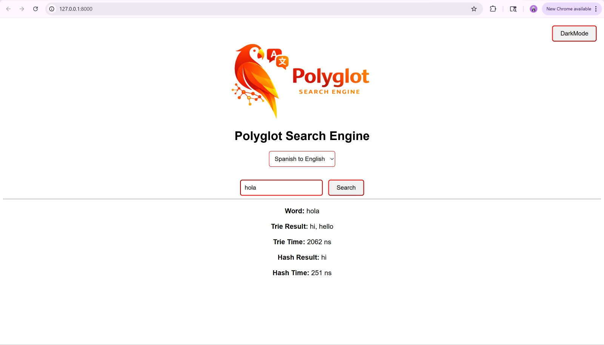
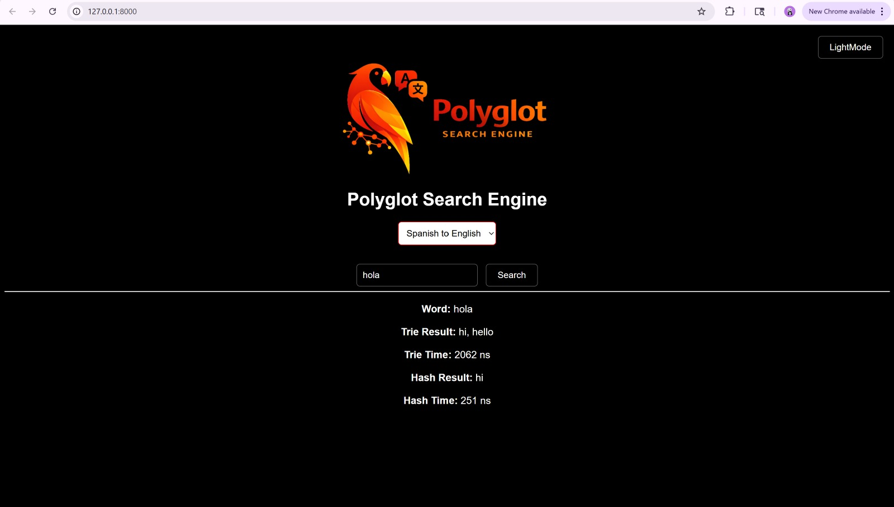

#Polyglot Search Engine
- A bilingual sarch engine that translates words between **English and Spanish** using two custom-built data structures: a **Trie** and a **Hash Table**.
- This project was created for **COP3530 Project 2** to compare the performance of two data structures on a dataset of over 100,000 translation pairs.
---

 ## Table of Contents
- [Project Overview](#project-overview)
- [Features](#features)
- [Tools and Languages Used](#tools-and-languages-used)
- [Data Structures Used](#data-structures-used)
- [Performance Comparison](#performance-comparison)
- [How to Run](#how-to-run)
- [How to Use](#how-to-use)
- [Appearance](#appearance)
- [Team Contributions](#team-contributions)
---

## Project Overview
### Problem and Motivation
- Vocabulary learners frequently seek for tools that could help them effectively and efficiently search through vocabulary or unfamiliar alphabet through different languages. In general, searching through words in a vocabulary dataset contains more than 100,000 words causing structures that would typically run quickly to start slowing down. With this in mind, our project will analyze which data structure has the best performance when handling large datasets, in order to improve the speed of vocabulary word searches. Our goal is to create a search tool for multilingual vocabulary as well as analyze the performance difference in storing and retrieving words from a large vocabulary dataset using two different types of data structures, which are Trie and Hash Table.
---

## Features
- English to Spanish word translation
- Spanish to English word translation
- Case-insensitive search
- Multiple translations per word
	> Example:
		Ve, Vete, Vayase, etc.
 	> 
- Trie-based search implementation
- Hash table-based search implementation
- Runtime comparison between both structures
- Frontend webpage interface
- Flask bridge between frontend and C++ backend
---

## Tools and Languages Used
- **C++**: Core data structures and search logic
- **Python (Flask)**: Bridge between frontend and backend
- **HTML / CSS / JavaScript**: User Interface (UI)
- **GitHub**: Collaboration and version control
---

## Data Structures Used
### Trie
The trie stores words character-by-character, making it efficient for structured word lookup.
### Hash Table
The hash table stores words by hashing the input word into a bucket.
---

## Performance Comparison
The program measures:
- **Build time** for loading the dataset into each structure
- **Search time** for word lookup in each structure
Timing is being tracked using C++ `chrono` and the selected time unit: **nanoseconds (ns)**.
> Note: Search times may vary slightly between runs due to system execution and ns being a small unit of measurement.
> 
---

## How to Run
Steps to run the program:
1. Open the project folder in VS Code
2. Open two terminals in the project folder
3. In the **first terminal**, run: python bridge.py
4. In the **second terminal** run: python -m http.server 8000 --bind 127.0.0.1 , it will give you a link (you can click and it will take you to the website in your browser), or open your browser and go to: http://127.0.0.1:8000/

## How to Use
1. Type a word in the search bar
2. Select a direction: english_to_spanish or spanish_to_english
3. View the translation and compare Trie vs Hash Table search times
---

## Appearance
### Light Mode Webpage

### Dark Mode Webpage

---

## Team Contributions
### Diya
- Wrote the functionality of the parsing through the dataset and the hash table with insertion and search logic
### Ariella
- Wrote the functionality of the timer and trie with insertion and search logic
### Grecia
- Wrote the frontend interface, bridged it with the C++ backend, and wrote instructions for compiling and running the program.

